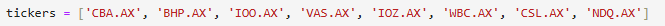

# Portfolio-Optimization - Educational Purposes 
## What is Portfolio-Optimization
Portfolio optimization is the process of selecting the best portfolio (asset allocation) out of a set of all possible portfolios being considered to achieve an objective. This process typically attempts to maximize factors such as expected return, while minimizing factors such as expenses, volatility and risk. The optimal portfolio varies and is influenced by each individual investor’s return objectives and risk tolerance.

Portfolio Optimization with ASX(Australian Stock Exchange) companies.

## Tickers

Can customise tickers by using Yahoo Finance to get stock tickers and inputing as such.

## Dependencies
- Numpy
- Pandas
- Matplotlib
- YFinance
- Datetime
